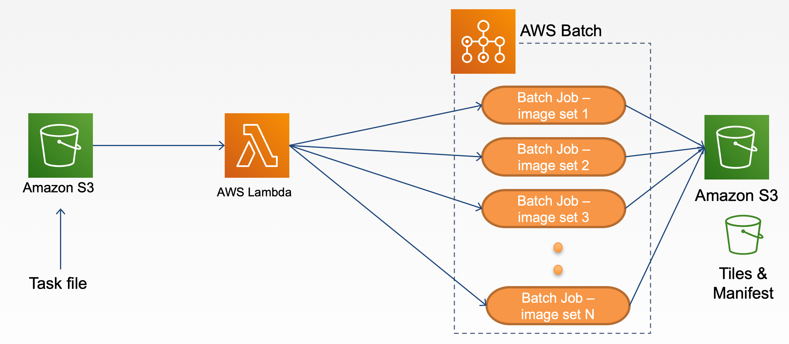
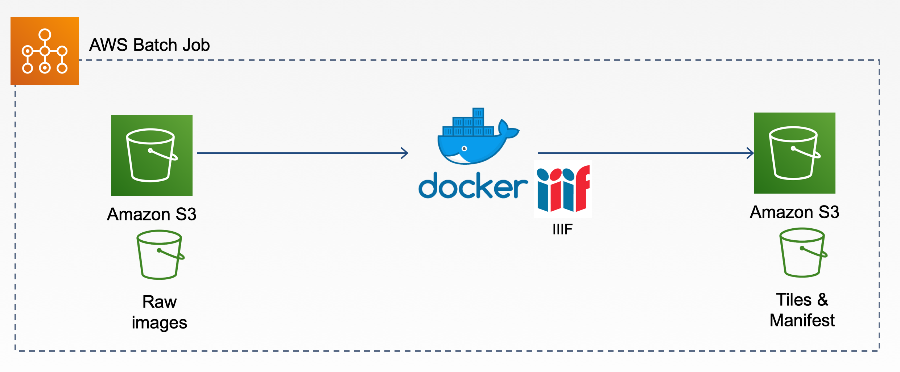

# aws-batch-iiif-generator

## Publication

- [Code4Lib Journal - Scaling IIIF Image Tiling in the Cloud](https://journal.code4lib.org/articles/14933)

## Workflow



1. Upload task file to the batch bucket
2. Batch bucket trigger launches an instance of a Lambda function
3. The Lambda function reads the content in the task file and submits a batch job
4. Each batch job generates tiles and manifests from the original image and uploads the generated derivatives to the target S3 bucket



1. Pull raw original files from the S3 bucket
2. Generate tiles and manifests
3. Upload to target S3 bucket

### Deploy aws-batch-iiif-generator using CloudFormation stack

#### Step 1: Launch CloudFormation stack

[](https://console.aws.amazon.com/cloudformation/home?region=us-east-1#/stacks/new?&templateURL=https://vtlib-cf-template.s3.amazonaws.com/prod/cf-templates/aws-batch-iiif-generator/20240612/awsiiifs3batch.template)

Click _Next_ to continue

#### Step 2: Specify stack details

Note: It's a good idea to provide a namespace for these resource names to prevent collisions (prepend resource names w/ stack name maybe? Don't prepend anything to the `DockerImage`)
| Name | Description |
| ------------------- | ---------------------------------------------------------- |
| Stack name | any valid name |
| BatchRepositoryName | any valid name for Batch process repository |
| DockerImage | any valid Docker image. E.g. wlhunter/iiif_s3_tiling:latest |
| JDName | any valid name for Job definition |
| JQName | any valid name for Job queue |
| LambdaFunctionName | any valid name for Lambda function |
| LambdaRoleName | any valid name for Lambda role |
| S3BucketName | any valid name for S3 bucket |

#### Step 3: Configure stack options

Leave it as is and click **Next**

#### Step 4: Review

Make sure all checkboxes under Capabilities section are **CHECKED**

Click _Create stack_

### Deploy aws-batch-iiif-generator using AWS CLI

Run the following in your shell to deploy the application to AWS:

```bash
aws cloudformation create-stack --stack-name awsiiifs3batch --template-body file://awsiiifs3batch.template --capabilities CAPABILITY_NAMED_IAM
```

See [Cloudformation: create stack](https://docs.aws.amazon.com/cli/latest/reference/cloudformation/create-stack.html) for `--parameters` option

### Usage

- Prepare [task.json](examples/task.json)
- Prepare [dataset](examples/sample_dataset.zip) and upload to S3 `AWS_SRC_BUCKET` bucket
- Edit the `jobQueue` and `jobDefinition` values in [task.json](examples/task.json) to match the resource names specified during stack creation.
- Upload [task.json](examples/task.json) to the S3 bucket created after the deployment.
- Go to `AWS_DEST_BUCKET` to see the end results for generated IIIF tiles and manifests.
- Test manifests in [Mirador](https://projectmirador.org/demo/) (Note: you need to configure S3 access permission and CORS settings)
- See our [Live Demo](https://d2fmsr62h737j1.cloudfront.net/index.html)

### Cleanup

To delete the sample application that you created, use the AWS CLI. Assuming you used your project name for the stack name, you can run the following:

```bash
aws cloudformation delete-stack --stack-name stackname
```

## Batch Configuration

- Compute Environment: Type: `EC2`, MinvCpus: `0`, MaxvCpus: `128`, InstanceTypes: `optimal`
- Job Definition: Type: `container`, Image: `DockerImage`, Vcpus: `2`, Memory: `2000`
- Job Queue: Priority: `10`

## S3

- AWS_SRC_BUCKET: For raw images and CSV files to be processed
  - Raw image files
  - CSV files
- AWS_DEST_BUCKET: For saving tiles and manifests files

## Lambda function

- [index.py](src/index.py): Submit a batch job when a task file is uploaded to a S3 bucket

## Task File

- example: [task.json](examples/task.json)

| Name                  | Description                                                                                                                                                                                               |
| --------------------- | --------------------------------------------------------------------------------------------------------------------------------------------------------------------------------------------------------- |
| jobName               | Batch job name                                                                                                                                                                                            |
| jobQueue              | Batch job queue name                                                                                                                                                                                      |
| jobDefinition         | Batch job definition name                                                                                                                                                                                 |
| command               | "./createiiif.sh"                                                                                                                                                                                         |
| AWS_REGION            | AWS region, e.g. us-east-1                                                                                                                                                                                |
| COLLECTION_IDENTIFIER | from collection metadata csv                                                                                                                                                                              |
| AWS_SRC_BUCKET        | S3 bucket which stores the images need to be processed. (Source S3 bucket)                                                                                                                                |
| AWS_DEST_BUCKET       | S3 bucket which stores the generated tile images and manifests files. (Target S3 bucket)                                                                                                                  |
| ACCESS_DIR            | Path to the image folder in `AWS_SRC_BUCKET`                                                                                                                                                              |
| DEST_PREFIX           | path pointing to the directory that contains your collection directory in `AWS_DEST_BUCKET` (This is generally your "collection category" and does not include COLLECTION_IDENTIFIER at the path's end. ) |
| DEST_URL              | Root URL for accessing the manifests e.g. https://cloudfront.amazonaws.com/...                                                                                                                            |
| CSV_NAME              | A CSV file with title and description of the images                                                                                                                                                       |
| CSV_PATH              | Path to the csv folder under the `AWS_SRC_BUCKET`                                                                                                                                                         |

## IIIF S3 Docker image

- [iiif_s3_docker](https://github.com/vt-digital-libraries-platform/iiif_s3_docker)
- Image at Docker Hub: [wlhunter/iiif_s3_tiling:0.0.1](https://hub.docker.com/repository/docker/wlhunter/iiif_s3_tiling/)
